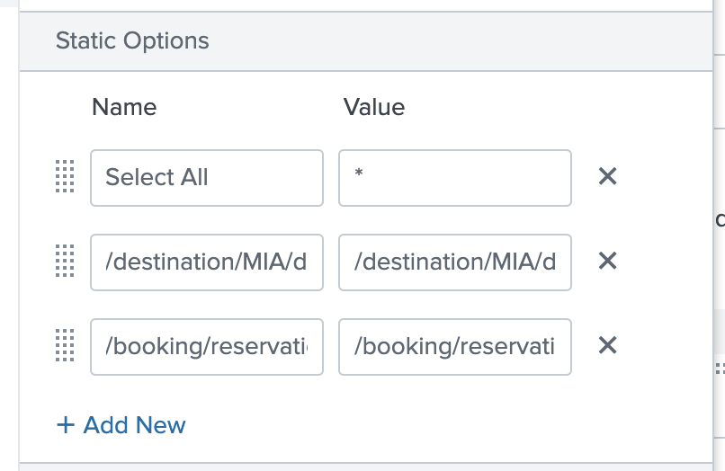

# Add Input Forms
Time: 30 minutes

## Instructions
Once you have a dashboard, you might need to have fields to update the data you see, mainly for debugging purposes. In this lab, you'll be adding more inputs to dashboard panels in addition to the one you added in the previous lab. You'll apply the `Token` concept in the search queries.

### Add a Static Dropdown Option
Based on the data you've indexed, think about which field you could use as a dropdown option&mdash;for example, the product ID.

- Edit the dashboard panel you created in the previous lab
- Add a dropdown input for the `http_uri` field, and make sure you fill in the "Static Options" section. Add static options like "/destination/MIA/details" and "/booking/reservation". Make sure you include an option that includes all options, like a "Select All". It should look like the following screen:



- In the "Token" text box, type `http_uri`. This will be the variable name that you'll be using when searching
- Edit the search query from the pie chart to include this input field
- Make sure that the search works by changing the options in the dropdown field

The new search query for the pie chart should look like this:

```
sourcetype=access_custom http_uri=$http_uri$ | top limit=20 http_status_code
```

### Add a Dynamic Dropdown Option
There are times when you'd like to filter based on the values from one of the fields you have in the data. In this case, let's use the `server_ip` field. Instead of statically specifying the "Server IPs" value in the search query, use the value from a dynamic dropdown.

Use this search query to populate the dropdown:

```
sourcetype=access_custom | stats count by server_ip | eval label=server_ip." (".count.")"
```

- Add a dropdown input, and make sure you fill in the `Dynamic Options` section with the search query from above
- In the `Token` text box type `server_ip`. This will be the variable name that you'll be using when searching
- Make sure you include an option that include all options, like a `Select All`
- Scroll down a bit. In the `Field For Label` text box type `label`, and in the `Field For Value` text box, type `server_ip`
- Click on `Apply`
- Edit the search query from the pie chart to include this input field. (It's already included, so you need to use the token now)
- Make sure that the search works by changing the options in the dropdown field

The new search query for the pie chart should look like this:

```
sourcetype=access_custom http_uri=$http_uri$ server_ip=$server_ip$ | top limit=20 http_status_code
```
