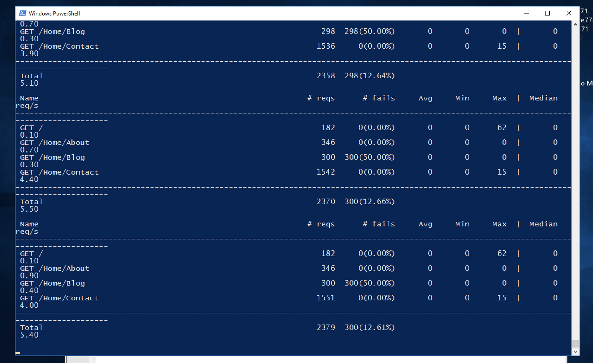

# NGINX Logs to Splunk
Time: 1 Hour

## Instructions
As a final lab, you'll now configure a typical scenario when using Splunk. You'll install and configure an NGINX and then the Splunk forwarder to collect logs in Splunk. With this lab, you can apply everything you've learned so far.

### Enable a Data Receiver Port in Splunk Enterprise
By default, Splunk Enterprise isn't enabled to receive data from forwarders. So let's enable it:

- Go to "Settings > Forwarding and receiving"
- In the "Receive data" section, click on "Configure receiving"
- Click on "New Receiving Port"
- Type "9997" and then click on "Save"

### Install NGINX in Another Server
*In a different server than Splunk*, install NGINX with the following command. You're doing this so you can practice installing and configuring the Splunk forwarder to the servers from where you'd like to collect logs.

```
sudo apt update
sudo apt install nginx -y
```

Make sure that NGINX is working by opening a browser window using the public IP of the server.

### Configure the NGINX Logs Format
Modify the `/etc/nginx/nginx.conf` file with the following configuration in the `http` section before the `access_log` line:

```
log_format adv 'site="$server_name" server="$host” dest_port="$server_port" '
               'dest_ip="$server_addr" src="$remote_addr" src_ip="$realip_remote_addr" '
               'user="$remote_user" time_local="$time_local" protocol="$server_protocol" '
               'status="$status" bytes_out="$bytes_sent" '
               'bytes_in="$upstream_bytes_received" http_referer="$http_referer" '
               'http_user_agent="$http_user_agent" nginx_version="$nginx_version" '
               'http_x_forwarded_for="$http_x_forwarded_for" '
               'http_x_header="$http_x_header" uri_query="$query_string" uri_path="$uri" '
               'http_method="$request_method" response_time="$upstream_response_time" '
               'cookie="$http_cookie" request_time="$request_time" ';
```

Modify the `access_log` line by adding the `adv` format at the end. Also, change the log to `notice` for the error logs:

```
access_log /var/log/nginx/access.log adv;
error_log /var/log/nginx/error.log notice;
```

Now make sure that the configuration is OK:

```
sudo /usr/sbin/nginx -t
```

And restart the NGINX server with the following command:

```
sudo service nginx restart
```

Verify that the NGINX site is loading.

### Install and Configure the Splunk Forwarder (Extra)
Here are the commands to install and configure the Splunk forwarder in the server where NGINX is installed. You'll need to configure a user/pass:

```
wget https://download.splunk.com/products/universalforwarder/releases/7.2.4/linux/splunkforwarder-7.2.4-8a94541dcfac-linux-2.6-amd64.deb
sudo dpkg -i splunkforwarder-7.2.4-8a94541dcfac-linux-2.6-amd64.deb
sudo /opt/splunkforwarder/bin/splunk start --accept-license
sudo /opt/splunkforwarder/bin/splunk enable boot-start
```

### Collect Data With the Splunk Forwarder
Configure the Splunk forwarder to send data to the Splunk Enterprise indexer by running the following command. You'll need use the IP that was assigned to you:

```
sudo /opt/splunkforwarder/bin/splunk add forward-server {{SPLUNK_HOST}}:9997
```

Now configure the Splunk forwarder to send the NGINX logs to Splunk. Edit the `inputs.conf` file:

```
sudo vim /opt/splunkforwarder/etc/system/local/inputs.conf
```

Add the following configuration to the file:

```
# Monitor NGINX Logs

[monitor:///var/log/nginx/access.log]
disabled = false
sourcetype = nginx:kv


[monitor:///var/log/nginx/error.log]
disabled = false
sourcetype = nginx:error
```

Finally, restart the Splunk forwarder to start sending the data.

```
sudo /opt/splunkforwarder/bin/splunk restart
```

To make sure that everything is working, reload the NGINX site and check that the access logs are now being sent to Splunk.

### What's Next? Simulation Time!
Here's where the fun begins. You'll now need to hammer the web server to generate enough traffic and then generate log entries to Splunk. There's a Python application that you can use in the server to generate traffic. Here's how to use it:

1. The files for load testing has been previously uploaded to the server. There should be a `loadtest` folder on the desktop. Open the folder, and you should see a few files.
2. Open a command prompt, like Powershell, and run the following command:

```
chmod +x loadgen.sh
sh loadgen.sh
```

3. If for some reason the script fails, just run it again. Even if you see an error in the output, leave it there. You should see the stats from the load test.



After you've generated enough traffic, let's practice what you've learned:

- Schedule a report with the top five most visited paths (URLs) in the site
- Schedule a report with the top five paths with a 404 status code
- Create a dashboard panel where you include the following:
    - The top five most visited paths
    - The top five paths with a 404 status code
    - A linear graphic distribution showing the traffic sent
    - A big number showing how many requests are being received per second
    - A search where you can see all the events from NGINX

### References
- https://www.nginx.com/blog/operational-intelligence-nginx-plus-splunk-enterprise/
